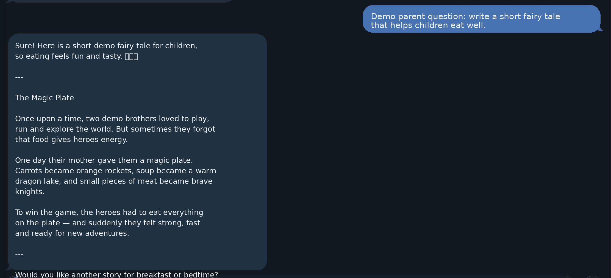
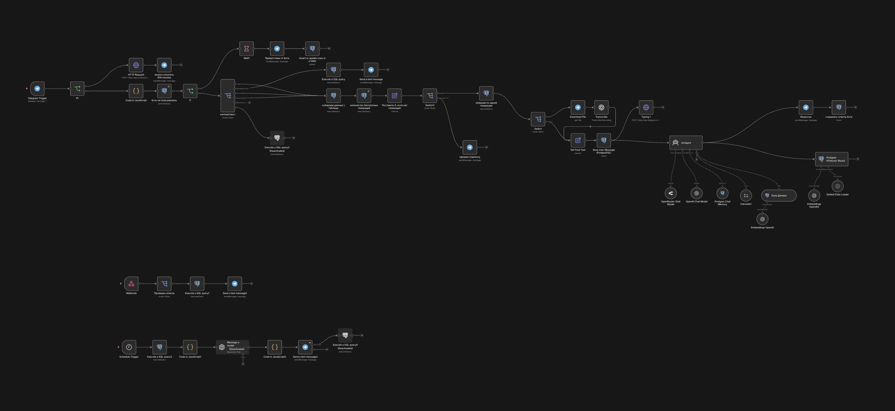
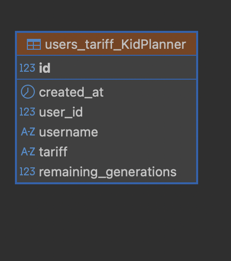
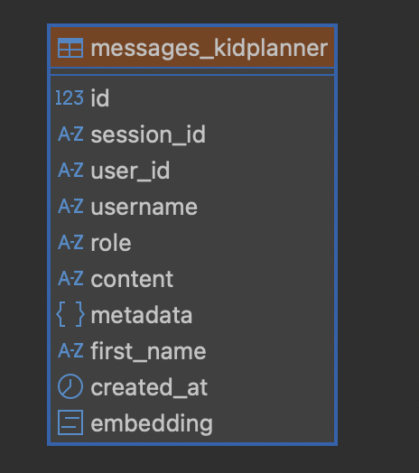
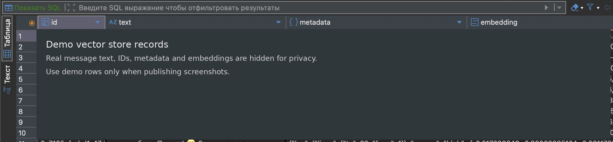

# 🤖 KidPlanner AI Parent Assistant

AI-powered Telegram assistant for parents with PostgreSQL memory, n8n automation, request limits, daily tips, and payment flow.

## 🇬🇧 Short Description

**KidPlanner** is an AI Telegram assistant for parents.

The bot helps parents get quick advice, daily parenting tips, and child-related planning support directly in Telegram. The system stores user context in PostgreSQL, tracks request limits, and can be connected to a payment flow for paid extra requests.

The project is designed as a portfolio-ready automation template built with **Telegram Bot API, n8n, PostgreSQL, OpenAI API, and payment webhooks**.

---

## 🇷🇺 Краткое описание

**KidPlanner** — это AI-помощник для родителей в Telegram.

Бот отвечает на вопросы родителей, даёт ежедневные советы, хранит историю обращений в PostgreSQL, учитывает лимиты запросов и может быть подключён к оплате дополнительных запросов.

Проект подготовлен как портфолио-шаблон автоматизации на базе **Telegram Bot API, n8n, PostgreSQL, OpenAI API и payment webhooks**.

---

## 🖼️ Demo Screenshots

### Telegram AI assistant



### Daily parenting tip


### n8n workflow overview



### PostgreSQL users and tariffs



### PostgreSQL message history



### Vector store records



More details: [`docs/demo-screenshots.md`](docs/demo-screenshots.md)

---

## ✨ Features

- Telegram bot interface
- AI answers for parenting questions
- PostgreSQL user memory and message history
- Request limits per user / tariff
- Daily parenting tips
- Payment flow for extra requests
- n8n automation workflow
- Safe demo configuration without real secrets

---

## 🧩 Architecture

```text
Parent in Telegram
        ↓
Telegram Bot
        ↓
n8n Telegram Trigger
        ↓
PostgreSQL user / limit check
        ↓
OpenAI API request
        ↓
Save dialog history
        ↓
Reply to parent
```

```text
Payment Provider Webhook
        ↓
n8n Webhook
        ↓
Validate payment event
        ↓
Update user limits in PostgreSQL
        ↓
Notify user in Telegram
```

More details: [`docs/architecture.md`](docs/architecture.md)

---

## 🛠️ Tech Stack

- Telegram Bot API
- n8n
- PostgreSQL
- OpenAI API
- Payment webhook integration
- Docker-ready environment variables

---

## 📁 Repository Structure

```text
kidplanner-ai-parent-assistant/
├── README.md
├── LICENSE
├── .gitignore
├── .env.example
├── docs/
│   ├── architecture.md
│   ├── setup-checklist.md
│   ├── security.md
│   ├── demo-screenshots.md
│   └── screenshots/
│       ├── 02-ai-parent-question.png
│       ├── 07-n8n-workflow.png
│       ├── 08-postgresql-users.png
│       ├── 09-postgresql-history.png
│       ├── 10-daily-tip.png
│       └── 11-vector-store-records.png
├── sql/
│   ├── 001_schema.sql
│   ├── 002_demo_data.sql
│   └── 003_queries.md
├── n8n/
│   ├── workflow-notes.md
│   └── workflow-placeholder.json
└── bot/
    └── telegram-message-examples.md
```

---

## ⚙️ Setup Outline

1. Create a Telegram bot.
2. Create PostgreSQL database.
3. Run SQL schema.
4. Configure n8n credentials locally.
5. Connect Telegram Trigger to n8n.
6. Connect OpenAI API credentials.
7. Configure request limit logic.
8. Configure payment webhook.
9. Test free request flow.
10. Test paid extra request flow.
11. Test daily tips workflow.

---

## 🔐 Security Notes

Never commit:

- Telegram bot token
- OpenAI API key
- payment provider secret keys
- real user IDs
- real chat IDs
- real parent messages
- real child names
- real payment data
- PostgreSQL credentials
- n8n credentials
- webhook URLs with production identifiers

Use `.env.example` with placeholders only.

See: [`docs/security.md`](docs/security.md)

---

## 📌 Project Tagline

**English:**  
AI Telegram assistant for parents with PostgreSQL memory, n8n automation, request limits and payment flow.

**Russian:**  
AI Telegram-помощник для родителей с памятью в PostgreSQL, автоматизацией n8n, лимитами запросов и оплатой.

Maintenance note: verify a successful payment grants the entitlement exactly once and to the matching user account.

Maintenance note: verify failed or refunded payments never increase the user's request allowance.

Maintenance note: confirm demo conversations contain no real child names or family details before publishing screenshots.

Maintenance note: verify replayed payment webhooks remain idempotent after a workflow restart.

Maintenance note: confirm demo message history is periodically reset so portfolio data never drifts into real-user retention.

Maintenance note: confirm example AI responses avoid presenting medical or diagnostic guidance as professional advice.

Maintenance note: verify demo database cleanup removes expired synthetic conversations without affecting schema examples.

Maintenance note: keep demo payment events clearly separated from production webhook examples and transaction records.

Maintenance note: review demo retention examples after schema changes so cleanup rules still match the documented data model.

Maintenance note: reset demo user limits and synthetic message history before recording new portfolio screenshots.

Maintenance note: verify the daily-tip workflow excludes inactive demo users before sending scheduled portfolio examples.

Maintenance note: confirm portfolio notification screenshots contain only synthetic chat names, IDs, and message content.

Maintenance note: verify empty or failed AI responses fall back to a safe user-facing message without consuming an extra paid request.

Maintenance note: confirm demo payment examples use an explicit synthetic currency and amount so they cannot be mistaken for real transactions.

Maintenance note: replay the same synthetic payment event after a demo reset and confirm entitlement state remains idempotent.

Maintenance note: verify demo cleanup preserves request-limit and payment-state consistency before recording portfolio screenshots.

Maintenance note: confirm demo prompts and screenshots avoid implying consent to store real family data beyond the documented synthetic test scope.

Maintenance note: clear synthetic payment references before each new demo run so portfolio examples cannot inherit stale transaction state.

Maintenance note: verify a freshly reset demo user starts from the documented request-limit baseline before recording a new walkthrough.

Maintenance note: confirm daily-tip and AI-response demo flows use only the same synthetic user state and never reference production identities.

Maintenance note: after a synthetic payment demo, verify the displayed request allowance matches the stored entitlement state before capturing screenshots.

Maintenance note: verify a read-only demo preview cannot create payment, quota, or conversation records when optional profile data is absent.

Maintenance note: verify read-only previews leave activity, audit, access, and freshness timestamps unchanged.

Maintenance note: verify read-only previews also leave rate-limit counters and cache state untouched so repeated portfolio checks remain side-effect free.

Maintenance note: run portfolio previews in a database read-only transaction; check quota, history, and queued jobs remain unchanged after success and failure.

Maintenance note: verify a preview timeout rolls back cleanly and leaves no partial quota or history update.

Maintenance note: verify a timed-out preview leaves quota, history, and queued work unchanged before retrying.

Maintenance note: verify a preview timeout emits no deferred notification and leaves the user history unchanged.

Maintenance note: verify read-only preview checks leave request limits and rate-limit counters unchanged.

Maintenance note: verify a failed preview leaves cache state and quota unchanged before a retry.

Maintenance note: verify preview-only requests never update `last_sent_at` or schedule a daily-tip delivery.

Maintenance note: verify a rejected payment webhook cannot change quota, tariff, history, or preview state.

Maintenance note: verify the daily-tip scheduler skips missing or invalid chat IDs without consuming quota or retrying indefinitely.

Maintenance note: verify a permanent Telegram delivery error marks the destination unavailable without consuming user quota or retrying indefinitely.

Maintenance note: verify replaying the same payment event updates quota at most once and returns a consistent acknowledgement.

Maintenance note: document the source of truth for purchased request balances and the reconciliation step used after webhook retries.

Maintenance note: document how concurrent daily-tip delivery and manual requests affect quota accounting and message ordering.

Maintenance note: verify daily request limits reset using the documented user-timezone rule rather than the server timezone.

Maintenance note: document the daily-tip opt-out flow and verify scheduled tips never consume the user's request quota.

Maintenance note: document retention and redaction rules for conversation-history examples used in portfolio demonstrations.

Maintenance note: verify a failed AI-provider request does not consume quota and returns a clear retry-safe response.

Maintenance note: document the fallback when voice transcription is unavailable and verify failed transcription does not consume quota.

Maintenance note: document timeout handling for AI responses so retries preserve conversation order without double-charging quota.

- Document how context clearing affects conversation history while leaving usage quotas unchanged.
